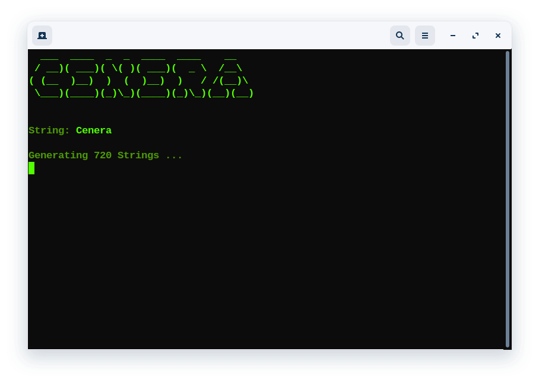

<div align="center">
  <a href="https://github.com/fledpaul/cenera">
    
  </a>
  
  <h3 align="center">Cenera - Permutations Made Simple</h3>
  <p align="center">
    Cenera is a tool to quickly find all possible anagrams of a word.
    <br/>
    <a href="https://projects.fled.dev/cenera"><strong>View Details»</strong></a>
    <br/>
    <br/>
    <a href="https://github.com/othneildrew/Best-README-Template/issues">Report Bug</a>
    ·
    <a href="https://github.com/othneildrew/Best-README-Template/issues">Request Feature</a>
  </p>
</div>

## About The Project
<div align="center">
  <a href="https://github.com/fledpaul/preview">
    
  </a>
</div>
<br>

With Cenera I try to offer everyone, no matter if beginner,
advanced or professional a simple software to generate
all permutations fast and easy.

### Built With
* [Python](https://python.org/)

## Getting Started
### Prerequisites
  ```sh
  pip install termcolor
  ```
  
  ## Usage
  Unzip the zip file & open a terminal in your download folder.
  ```sh
  cd /cenera-main/
  ```
  ```sh
  python3 main.py
  ```
  That's it. You have successfully started Cenera.
  
  ## Roadmap
- [x] Add .exe
- [ ] Add Changelog
- [ ] Detect Real Words
- [ ] Multi-Language Support
    - [ ] German
    - [ ] Spanish
    - [ ] Mandarin
    - [ ] Hindi
    - [ ] French

## Donations
```sh
Bitcoin: bc1q0jlnpzyewqxn4dlmn5kxplq0etchhjf880mw64
```

```sh 
Bitcoin Cash: qp9fxxrejkwp0zmrd3kjavd7xt7c7gdx0uar7f9j6w
```

```sh
Ethereum: 0x0B58C4FA54E81193E60dc0312f98C3738999fC45
```

```sh
Zilliqa: zil1m6eyqm7flq2cwkxm8l60g836a75yq5mtdzlcjw
```

Each donation will be distributed among contributors.

## License
Distributed under the MIT License. See `LICENSE.txt` for more information.

<!-- CONTACT -->
## Contact

Twitter - [@fledpaul](https://twitter.com/fledpaul)
<br>
E-Mail - contact@github.fled.dev

Project Link: [https://github.com/fledpaul/cenera](https://github.com/fledpaul/cenera)
